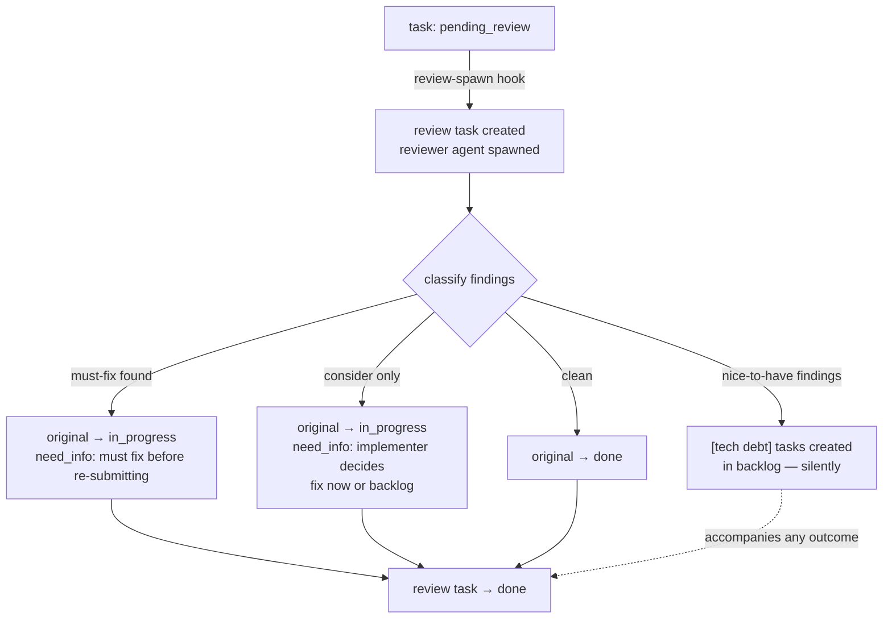

# logbook: kanban for ai agents

logbook is a kanban board implementation for autonomous agentic development, focusing on autonomous development and context window management.

## problem

ai agents changed the way software teams worked, and with specification-driven development we encounter a rift: **agents don't manage their tasks as we do**.

### what's the issue with this?

- hard for humans to track autonomous work properly: **"do you know what specific tasks your agent did?"**
- hard for agents to track tasks in-progress and done: **not a centralized way to track tasks so each instance haves to figure this out**
- existing tools add too much overload and are human-centered: **if an agent is going to use it, then it should be tailored for agents**

## solution

logbook is a file-system based kanban board that uses jsonl files to enter one task per line in a structured and clean approach and gives the agent the right tools to use it:

### tools

- the agent can call `list_tasks(status)` and receive a list of the tasks in that status _(in_progress by default)_
- the agent can call `current_task()` and receive the highest-priority in_progress task for the current session, resolved via this priority chain:

  | priority | condition | action |
  |----------|-----------|--------|
  | 1 | task already assigned to this session | return highest priority (tie-break: oldest) |
  | 2 | unassigned `in_progress` task | claim highest priority, return |
  | 3 | `in_progress` task with a dead-session assignee | claim highest priority, return |
  | 4 | `todo` task | auto-transition highest priority to `in_progress`, claim, return |
  | 5 | nothing available | fail with `no_current_task` |
- the agent can call `update_task(id, new_status, comment)` to transition a task, add a comment, or reply to a `need_info` blocking comment
- the agent can call `create_task(input)` to open a new task in `backlog`, passing `predictedKTokens` so the server derives a Fibonacci estimation automatically
- the agent can call `edit_task(id, updates)` to change mutable fields without altering status

each one of these tools has the sole purpose of removing overload from the agent context, handling the _"heavy load"_ programmatically on the MCP server.

## architecture

- **runtime**: Bun / TypeScript
- **effect system**: Effect.ts — all async operations and errors are modeled as `Effect<A, E, R>`
- **architecture**: hexagonal (ports & adapters), organized by vertical slices per domain concept (task, hook)
- **validation**: Zod at every system boundary (MCP input, filesystem reads)
- **persistence**: JSONL — one task per line, append-only writes, full file scan for reads

JSONL was chosen for simplicity and agent-friendliness: a single line = a single task makes partial reads and diffs readable without tooling.

### hooks

besides the tools that the agent call manually, each action performed in the kanban can have automatic _hooks_ executed right before or after.
the default hooks include:

- after moving a task to `need_info`, the user receives a notification with the comment left to be able to answer the question.
- after moving a task to `pending_review`, a reviewer sub-agent spawns and a review task is automatically generated for it.
- when a second task is moved to `in_progress`, a built-in hook fires and requires a comment justifying the overlap before proceeding.

but hooks can also be defined by the user as scripts in any language as long as it's installed in the system, under the "hooks/" directory, following this structure:

```
hooks/
└── example_hook/
    ├── config.yml
    └── script.ts
```

a minimal `config.yml` looks like:

```yaml
# config.yml
event: task.status_changed   # lifecycle event that triggers the hook
condition: "new_status == 'need_info'"  # optional; JS-like expression
timeout_ms: 5000             # optional; default 5000
```

you can base your config.yml in the default hooks-which have complete configuration files.

> note: as mentioned, you can change .ts for any language, but the .yml / .yaml is required for configuration.

#### review flow

when a task is moved to `pending_review`, the built-in `review-spawn` hook automatically creates a review task and spawns a reviewer sub-agent. the reviewer classifies every finding before acting:



| finding severity | original task | review task | side effect |
|-----------------|---------------|-------------|-------------|
| **must-fix** | `→ in_progress` + `need_info` | `→ done` | — |
| **consider** | `→ in_progress` + `need_info` | `→ done` | implementer replies: fix now or backlog |
| **nice-to-have** | unchanged | — | `[tech debt]` backlog task created |
| **clean** | `→ done` | `→ done` | — |

nice-to-have findings are always handled silently — they never block progress or ping the implementer.

#### why hooks?

hooks don't need to store information from one execution to the other, so the main principle here is: **"execute and forget"**, this way we can focus on the kanban and actual tasks.

## contracts

the core types the server operates on:

```ts
type Agent = {
  id: string,       // session_id assigned by the server on connection
  title: string,
  description: string
}

type Status = 'backlog' | 'todo' | 'need_info' | 'blocked' | 'in_progress' | 'pending_review' | 'done'

type Comment = {
  id: string,
  timestamp: Date,
  title: string,
  content: string,
  reply: string,  // user's reply, populated when responding to a need_info comment
  kind: 'need_info' | 'regular'  // drives the reply cycle — only need_info comments accept replies
}

type Task = {
  project: string,
  milestone: string,
  id: string,
  title: string,
  definition_of_done: string,
  description: string,
  estimation: number,      // fibonacci number derived from predictedKTokens at creation time
  comments: Comment[],
  assignee: Agent,
  status: Status,
  in_progress_since?: Date // set when task enters in_progress; used as tie-breaker in current_task
  priority: number         // integer ≥ 0; higher = more urgent; defaults to 0
}

// status defaults to 'in_progress'; results ordered by priority DESC
// project and milestone are optional; all provided filters compose (AND semantics)
type ListTasks = (options: { status: Status | '*', project?: string, milestone?: string }) => Task[]

// returns the highest-priority task for the current session using a priority chain:
// 1. own in_progress → 2. unassigned in_progress → 3. orphaned in_progress
// (dead-session assignee) → 4. highest-priority todo (auto-transitioned) → 5. no_current_task error.
// within each step, tasks are ordered by priority DESC, tie-broken by in_progress_since ASC.
// if a second task is moved to in_progress, a built-in hook fires and
// requires a comment justifying the overlap.
type GetCurrentTask = () => Task

// transitions a task to a new status; sessionId is injected server-side.
// to reply to a need_info comment, pass a comment with the existing comment's id and a reply string.
type UpdateTask = (id: string, new_status: Status, comment: CommentInput | null, sessionId: string) => void

type CommentInput = {
  id?: string,     // existing comment id — only when replying to a need_info comment
  title: string,
  content: string,
  reply?: string,  // reply text — only meaningful when id refers to a need_info comment
  kind: 'need_info' | 'regular'
}

// creates a new task in backlog assigned to the calling session.
// predictedKTokens is mapped to a Fibonacci estimation by the server.
type CreateTask = (input: CreateTaskInput, sessionId: string) => Task

type CreateTaskInput = {
  project: string,
  milestone: string,
  title: string,
  definition_of_done: string,
  description: string,
  predictedKTokens: number,  // positive number; server maps this to a Fibonacci estimation (max 20)
  priority?: number           // integer ≥ 0; defaults to 0
}

// edits mutable fields without changing status
type EditTask = (id: string, updates: EditTaskInput) => Task

type EditTaskInput = {
  title?: string,
  description?: string,
  definition_of_done?: string,
  predictedKTokens?: number,  // re-derives estimation if provided
  priority?: number            // integer ≥ 0; re-assigns priority if provided
}
```

each MCP session is treated as a distinct agent instance. the server assigns a `session_id` on connection and uses it to scope `GetCurrentTask` — no explicit agent ID needs to be passed by the caller.

## configuration

### environment variables

| Variable | Default | Description |
|----------|---------|-------------|
| `LOGBOOK_TASKS_FILE` | `./tasks.jsonl` | path to the JSONL task store |
| `LOGBOOK_HOOKS_DIR` | `./hooks` | directory scanned for custom hook definitions |

### gitignore

`tasks.jsonl` and `sessions.json` are runtime files generated by the MCP server — they should not be committed to version control:

```gitignore
tasks.jsonl
sessions.json
```

> note: the logbook repo itself intentionally commits these files for dogfooding — that is the exception, not the rule.

### client setup

**Claude Code** — add to `.claude/settings.json`:

```json
{
  "mcpServers": {
    "logbook": {
      "command": "logbook-mcp"
    }
  }
}
```

**OpenCode** — add to `opencode.json`:

```json
{
  "mcp": {
    "logbook": {
      "type": "local",
      "command": ["logbook-mcp"],
      "enabled": true
    }
  }
}
```

## security

### hook conditions are trusted code

hook `config.yml` files support an optional `condition` field (e.g. `"new_status == 'pending_review'"`). these conditions are compiled and evaluated as live JavaScript at runtime — equivalent in trust level to a shell script.

**what this means for you:**

- **only add hooks from sources you trust.** a malicious `config.yml` condition can execute arbitrary code in the process that runs the MCP server.
- **do not expose `LOGBOOK_HOOKS_DIR` to external write access.** if an untrusted process can write files under the hooks directory, it can inject conditions that execute as the MCP server's user.
- the built-in hooks shipped with logbook are safe — they use simple equality checks (`new_status == 'need_info'`).
- if a condition throws or is malformed, the hook is skipped silently and execution continues — it fails safe.

the security model here is the same as running a `Makefile` or a `.husky/` script: filesystem-level trust. as long as you control what goes into your hooks directory, you are safe.
